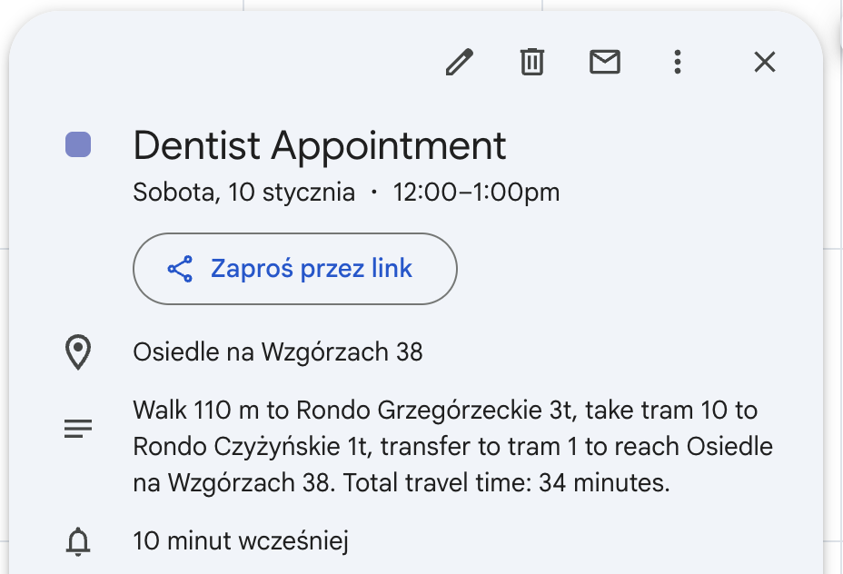
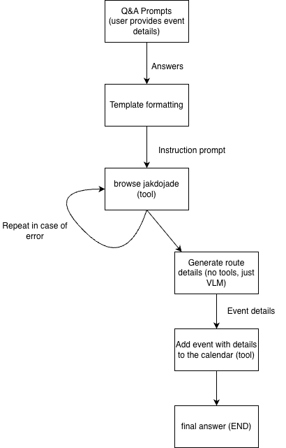

# Jakdojade Agent Tool

Jakdojade Agent Tool is an AI agent designed to facilitate the process of scheduling
events in the calendar. The agent finds the best bus route to get from the starting place
to the requested destination.

## Problem definition & Justification

Automated event scheduling using natural language. The problem is non-trivial as it requires using multiple services
in order to accomplish the task, thus using an agent is not an overkill. Such agent could be useful for non-technical people (given that a GUI is provided).

Example event generated by the agent:



## Agent workflow



## Setup

Project is built using `python 3.13.5`.

### Environment:
```bash
python -m venv .venv
source .venv/bin/activate
pip install -r requirements.txt
```

### Environment variables

Prepare a `.env` file with the following structure:
```
HF_TOKEN=<your_huggingface_token>
```
`HF_TOKEN` variable is required as the project uses Huggingface's model interface to generate answers.

### Calendar API setup
1. Go to [Google cloud console](https://console.cloud.google.com/).
2. Create a new project.
3. Navigate to **API's and services**.
4. Search for **Google Calendar API** → Enable.

### OAuth setup
1. Go to **APIs & Services → Credentials → Create Credentials → OAuth Client ID.**
2. Configure OAuth consent screen:
    - User Type: External (if for personal use, Internal is fine if part of your org)
    - Fill in app name, email, etc. (add your email as a test user).
3. Choose **Desktop App → Click Create.**
4. Download the JSON credentials file and save it as `credentials.json` in the project root.

## Results

### Watch the demo [here](https://drive.google.com/file/d/1qYUry9JWc3UBkdk5kD26g96k1NZR32wd/view?usp=sharing).

## Limitations

During testing, I noticed that the browsing tool is not perfect. Small models sometimes fail to recover if the tool fails.

Search results can sometimes be different from what we expect. If the starting or destination location are not listed first
the model might provide wrong results.

